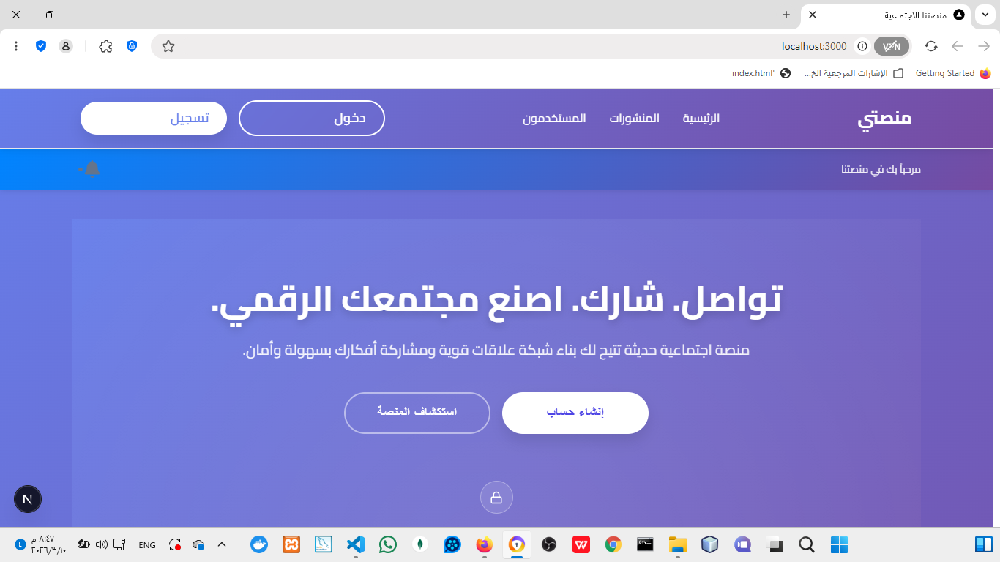

```markdown
# منصتي – شبكة اجتماعية عربية متكاملة


**منصتي** هي منصة اجتماعية عربية حديثة تهدف إلى بناء مجتمع رقمي متفاعل، تجمع بين سهولة الاستخدام، الأمان العالي، والتجربة السلسة. المشروع مبني باستخدام أحدث التقنيات في الويب (Next.js 15، React 19، TypeScript) مع دعم كامل للغة العربية والاتجاه من اليمين لليسار (RTL). تم تطويره ليكون قابلاً للتوسع، سهل الصيانة، ويوفر تجربة مستخدم استثنائية.

---

## 🔍 لماذا هذا المشروع؟

في عالم تتسارع فيه وتيرة التواصل الرقمي، تبرز الحاجة إلى منصات تجمع بين الأصالة العربية والحداثة التقنية. تم بناء **منصتي** لتكون حلًا متكاملاً يلبي احتياجات المستخدمين العرب في التواصل وبناء المجتمعات الرقمية، مع التركيز على:

- **تجربة مستخدم سلسة** – واجهة بديهية، تصميم متجاوب، وأداء عالي.
- **أمان على أعلى مستوى** – حماية البيانات، تشفير الاتصالات، ومصادقة آمنة.
- **قابلية التوسع** – بنية برمجية تسمح بإضافة الميزات بسهولة.
- **دعم كامل للغة العربية** – من الواجهة إلى المحتوى، مع احترام الثقافة العربية.

---

## ✨ المميزات الرئيسية

### 👤 للمستخدم العادي
- **تسجيل الدخول / إنشاء حساب** – مع التحقق من صحة البريد الإلكتروني وكلمة المرور، ودعم المصادقة الثنائية.
- **الملف الشخصي** – عرض وتعديل الصورة الشخصية، الغلاف، المعلومات الأساسية، مع معاينة فورية للصورة قبل الرفع.
- **المتابعة والمتابِعون** – متابعة مستخدمين آخرين وإلغاء المتابعة مع تحديث العداد تلقائياً وإشعارات فورية.
- **المنشورات** – إنشاء منشورات نصية مع إمكانية رفع صور وفيديوهات متعددة، دعم Markdown البسيط.
- **التفاعل مع المنشورات** – إبداء الإعجاب (مع 7 أنواع من التفاعلات)، التعليق، المشاركة، مع عدادات محدثة تلقائياً.
- **مشاركة المنشورات** – نافذة منبثقة لمشاركة المنشور عبر نسخ الرابط أو إرساله لمستخدم آخر عبر الرسائل الخاصة.
- **الرسائل الخاصة** – محادثات فورية بين المستخدمين مع إشعارات لحظية عبر WebSocket، حالة الكتابة، إشعارات القراءة.
- **الإشعارات** – تنبيهات فورية للمنشورات والرسائل والتفاعلات، مع جرس إشعارات ديناميكي وإمكانية تحديد الكل كمقروء.
- **البحث عن مستخدمين** – بحث ديناميكي بالاسم مع تأخير لتقليل الطلبات، مع إظهار حالة الاتصال.
- **صفحة المستخدمين** – استعراض جميع المستخدمين مع إمكانية المتابعة، فلترة حسب الاسم، وإحصائيات فورية.
- **روابط مباشرة للمنشورات** – دعم روابط `/posts/[id]` التي تعيد التوجيه إلى صفحة المنشورات العامة مع التمرير التلقائي إلى المنشور المطلوب وتمييزه.

### 👑 للأدمن (لوحة تحكم كاملة)
- **لوحة رئيسية** – بطاقات إحصائية (عدد المستخدمين، المنشورات، الرسائل، الإشعارات) مع تحديث فوري.
- **إدارة المستخدمين** – عرض، بحث، فلترة حسب الدور والحالة، حذف، تعطيل/تفعيل، تعديل الدور، مع إجراءات جماعية.
- **إدارة المنشورات** – عرض جميع المنشورات مع فلترة حسب وجود وسائط أو تبليغات، حذف فردي أو جماعي.
- **إدارة الرسائل** – عرض جميع المحادثات والرسائل مع إمكانية الحذف الفردي أو الجماعي، بحث في المحادثات.
- **التحليلات** – رسوم بيانية تفاعلية لأداء المنصة (نشاط يومي، توزيع المحتوى، نمو المستخدمين) مع إمكانية تغيير النطاق الزمني.
- **مراقبة النظام** – حالة الخدمات (قاعدة بيانات، API، Socket.IO)، استخدام الموارد (CPU، RAM، Disk)، تنبيهات عند تجاوز الحدود.
- **الإعدادات المتقدمة** – إعدادات عامة، أمان، إشعارات، خصوصية، مظهر، مع حفظ فوري وإعادة تعيين.
- **إنشاء أول أدمن** – صفحة خاصة لإنشاء أول حساب أدمن باستخدام بيانات super admin من ملف البيئة.

### 🛡️ الأمان
- **JWT مع HttpOnly Cookies** – تخزين آمن للتوكنات، منع هجمات XSS.
- **تشفير الباسوورد** – باستخدام bcrypt.
- **حماية المسارات** – Middleware للتحقق من الأدمن والمستخدم العادي.
- **تنظيف المدخلات** – حماية من هجمات Injection.
- **معدل الطلبات (Rate Limiting)** – للحد من الهجمات العنيفة.
- **CORS** – تهيئة صارمة للمصادر المسموح بها.
- **Helmet.js** – تعزيز أمان HTTP headers.
- **دوران التوكنات** – تجديد تلقائي للتوكنات قبل انتهاء صلاحيتها.

### ⚡ الأداء
- **تحميل تدريجي** – مكونات React مع `lazy` و `Suspense`.
- **إعادة استخدام المكونات** – `useCallback`, `useMemo`, `memo` لتقليل الـ renders غير الضرورية.
- **التخزين المؤقت** – بيانات المستخدمين والمنشورات في `localStorage` مع استراتيجية تحديث ذكية.
- **الصور** – تحسين تلقائي عبر Next.js Image، مع روابط كاملة للخادم الخلفي.
- **WebSocket** – اتصال دائم مع إعادة اتصال تلقائي عند انقطاع الشبكة.
## 🛠️ التقنيات المستخدمة (Tech Stack)

<div dir="rtl">

### 🏗️ البنية التحتية الأساسية (Core)
> تعتمد المنصة على أحدث التقنيات لضمان السرعة والأمان.

*  **إطار العمل:** التوجيه الذكي، SSR، وتحسين الأداء.
*  **الواجهة:** بناء مكونات تفاعلية متقدمة.
*  **لغة البرمجة:** ضمان أمان الأنواع وتجنب أخطاء التشغيل.

---

### 🎨 التصميم وتجربة المستخدم (UI/UX)
* ✨ **التنسيق:** استخدام `CSS Modules` لضمان عدم تداخل الأنماط بين المكونات.
* 📊 **البيانات:** `Recharts` لعرض إحصائيات المنصة برسوم بيانية تفاعلية.
* 🖼️ **الأيقونات:** مزيج احترافي بين `React Icons` و `Font Awesome`.

---

### 🔐 الاتصال والأمان (Backend Integration)
* ⚡ **الزمن الفعلي:** `Socket.io Client` لإرسال واستقبال الإشعارات فوراً.
* 📡 **الطلبات:** `Axios` مع نظام `Interceptors` لإدارة التوكنات والطلبات.
* 🛡️ **التشفير:** `JWT Decode` للتحقق من صلاحيات المستخدم محلياً.

---

### 🛠️ جودة الكود وإدارة الحالة
* 🧠 **إدارة الحالة:** `React Context` مع `Custom Hooks` لتنظيم منطق الأعمال.
* 📅 **التواريخ:** `date-fns` لمعالجة الأوقات بمرونة كاملة باللغة العربية.
* 💎 **المعايير:** `ESLint` و `Prettier` لضمان كود نظيف وموحد.

</div>
---
frontend/
├── public/                                 # الملفات الثابتة (صور افتراضية، أيقونات)
├── src/
│   ├── app/                                 # صفحات التطبيق (Next.js App Router)
│   │   ├── (auth)/                          # صفحات المصادقة (login, register, admin-login)
│   │   │   ├── login/
│   │   │   │   └── page.tsx
│   │   │   ├── register/
│   │   │   │   └── page.tsx
│   │   │   └── admin-login/
│   │   │       └── page.tsx
│   │   ├── admin/                            # صفحات لوحة التحكم
│   │   │   ├── analytics/
│   │   │   │   └── page.tsx
│   │   │   ├── messages/
│   │   │   │   └── page.tsx
│   │   │   ├── posts/
│   │   │   │   └── page.tsx
│   │   │   ├── settings/
│   │   │   │   └── page.tsx
│   │   │   ├── system/
│   │   │   │   └── page.tsx
│   │   │   ├── users/
│   │   │   │   ├── create/
│   │   │   │   │   └── page.tsx
│   │   │   │   └── page.tsx
│   │   │   ├── layout.tsx
│   │   │   └── page.tsx
│   │   ├── messages/
│   │   │   ├── [userId]/
│   │   │   │   └── page.tsx
│   │   │   └── page.tsx
│   │   ├── posts/
│   │   │   ├── [id]/
│   │   │   │   └── page.tsx                  # إعادة التوجيه إلى /posts?highlight=id
│   │   │   └── page.tsx
│   │   ├── profile/
│   │   │   └── [id]/
│   │   │       └── page.tsx
│   │   ├── users/
│   │   │   └── page.tsx
│   │   ├── error.tsx
│   │   ├── layout.tsx
│   │   ├── not-found.tsx
│   │   └── page.tsx
│   ├── components/                            # مكونات قابلة لإعادة الاستخدام
│   │   ├── admin/                             # مكونات خاصة بالأدمن
│   │   │   ├── AdminHeader.tsx
│   │   │   ├── AdminSidebar.tsx
│   │   │   ├── RecentPosts.tsx
│   │   │   ├── RecentUsers.tsx
│   │   │   └── SystemHealth.tsx
│   │   ├── layout/                            # مكونات التخطيط العام
│   │   │   ├── Footer.tsx
│   │   │   └── Navbar.tsx
│   │   ├── messages/                          # مكونات الرسائل
│   │   │   └── ChatBox.tsx
│   │   ├── notifications/                     # مكونات الإشعارات
│   │   │   └── NotificationBell.tsx
│   │   ├── posts/                             # مكونات المنشورات
│   │   │   ├── PostCard.tsx
│   │   │   ├── PostForm.tsx
│   │   │   ├── PostsList.tsx
│   │   │   └── ShareModal.tsx                 # نافذة مشاركة المنشور
│   │   ├── users/                             # مكونات المستخدمين
│   │   │   ├── ProfileCard.tsx
│   │   │   ├── UserCard.tsx
│   │   │   └── UserList.tsx
│   │   └── SocketInitializer.tsx
│   ├── context/                               # React Context
│   │   └── AuthContext.tsx
│   ├── hooks/                                  # Hooks مخصصة
│   │   ├── useAuth.ts
│   │   ├── usePosts.ts
│   │   └── useProfile.ts
│   ├── services/                               # خدمات API
│   │   ├── api.ts
│   │   ├── adminService.ts
│   │   ├── followService.ts
│   │   ├── messageService.ts
│   │   ├── notificationService.ts
│   │   ├── postService.ts
│   │   ├── socketService.ts
│   │   └── userService.ts
│   ├── types/                                  # تعريفات TypeScript
│   │   ├── Admin.ts
│   │   ├── Message.ts
│   │   ├── Notification.ts
│   │   ├── Post.ts
│   │   └── User.ts
│   ├── utils/                                  # أدوات مساعدة
│   │   ├── constants.ts
│   │   ├── formatDate.ts
│   │   └── security.ts
│   └── styles/                                 # أنماط عامة
│       ├── globals.css
│       └── variables.css
├── .env.local                                  # المتغيرات البيئية
├── next.config.js                              # إعدادات Next.js
├── package.json
└── README.md                                   # هذا الملف


</div>

---

## 🚀 كيفية تشغيل المشروع محلياً

### المتطلبات الأساسية

- **Node.js** v20 أو أحدث
- **npm** أو **yarn** أو **pnpm**
- خادم خلفي (Backend) يعمل على `http://localhost:5000` (راجع مستودع الـ backend الخاص)

### خطوات التشغيل

1. **استنساخ المستودع**
   ```bash
   git clone https://github.com/bzbsndndjnd/mansati-frontend.git
   cd mansati-frontend
   ```

2. **تثبيت الاعتماديات**
   ```bash
   npm install
   # أو
   yarn install
   ```

3. **إعداد المتغيرات البيئية**
   - أنشئ ملف `.env.local` في الجذر:
   ```env
   NEXT_PUBLIC_API_URL=http://localhost:5000
   NEXT_PUBLIC_SOCKET_URL=http://localhost:5000
   NEXT_PUBLIC_ADMIN_USER=admin
   NEXT_PUBLIC_ADMIN_PASS=123456
   NEXT_PUBLIC_ADMIN_EMAIL=admin@example.com
   ```

4. **تشغيل خادم التطوير**
   ```bash
   npm run dev
   # أو
   yarn dev
   ```
   سيفتح التطبيق تلقائياً على `http://localhost:3000`.

5. **بناء للإنتاج**
   ```bash
   npm run build
   npm start
   ```

---

## 📄 المتغيرات البيئية (Environment Variables)

| المتغير | الوصف | مثال |
|---------|--------|------|
| `NEXT_PUBLIC_API_URL` | رابط الخادم الخلفي | `http://localhost:5000` |
| `NEXT_PUBLIC_SOCKET_URL` | رابط خادم WebSocket | `http://localhost:5000` |
| `NEXT_PUBLIC_ADMIN_USER` | اسم مستخدم الأدمن الخارق (لـ /admin-login) | `admin` |
| `NEXT_PUBLIC_ADMIN_PASS` | كلمة مرور الأدمن الخارق | `123456` |
| `NEXT_PUBLIC_ADMIN_EMAIL` | بريد الأدمن الخارق | `admin@example.com` |

---

## 🌐 التوجيه (Routing) الرئيسي

| المسار | الوصف |
|--------|--------|
| `/` | الصفحة الرئيسية |
| `/login` | تسجيل الدخول |
| `/register` | إنشاء حساب جديد |
| `/admin-login` | دخول الأدمن الخارق (لإنشاء أول أدمن) |
| `/admin` | لوحة تحكم الأدمن |
| `/admin/analytics` | صفحة التحليلات |
| `/admin/messages` | إدارة الرسائل |
| `/admin/posts` | إدارة المنشورات |
| `/admin/settings` | إعدادات النظام |
| `/admin/system` | مراقبة النظام |
| `/admin/users` | إدارة المستخدمين |
| `/admin/users/create` | إنشاء مستخدم جديد |
| `/messages-list` | قائمة المحادثات |
| `/messages/[userId]` | صفحة المحادثة الكاملة |
| `/posts` | جميع المنشورات |
| `/posts/[id]` | إعادة التوجيه إلى `/posts?highlight=[id]` |
| `/profile/[id]` | الملف الشخصي لمستخدم |
| `/users` | قائمة المستخدمين |
| `/error` | صفحة الخطأ |
| `*` | صفحة 404 |

---

## 📡 الخدمات (Services) – التواصل مع API

يتم تنظيم جميع طلبات API في مجلد `services/` باستخدام **Axios** مع Interceptors لمعالجة التوكنات وإعادة المحاولة.

| الخدمة | الوظيفة |
|--------|---------|
| **api.ts** | تكوين Axios، إضافة التوكن، معالجة الأخطاء، تجديد التوكن |
| **adminService.ts** | جميع عمليات الأدمن (إحصائيات، مستخدمين، منشورات، رسائل) |
| **followService.ts** | متابعة/إلغاء متابعة، حالة المتابعة، جلب المتابعين |
| **messageService.ts** | إرسال واستقبال الرسائل، جلب المحادثات، تحديث حالة القراءة، البحث عن مستخدمين |
| **notificationService.ts** | جلب الإشعارات، تحديد كمقروء، حذف |
| **postService.ts** | إنشاء، جلب، تحديث، حذف المنشورات، إضافة تفاعلات وتعليقات ومشاركات |
| **socketService.ts** | إدارة اتصال WebSocket، إرسال واستقبال الأحداث الفورية |
| **userService.ts** | تسجيل الدخول، إنشاء حساب، تحديث المستخدم، رفع الصور |

### مثال على استخدام خدمة

```typescript
import postService from '@/services/postService';

const handleCreatePost = async (formData: FormData) => {
  try {
    const newPost = await postService.create(formData);
    console.log('تم إنشاء المنشور:', newPost);
  } catch (error) {
    console.error('فشل إنشاء المنشور:', error);
  }
};
```

---

## 🧩 المكونات الرئيسية (Components)

### المكونات العامة
- **Navbar** – شريط التنقل العلوي مع روابط وزر الدخول/الخروج.
- **Footer** – تذييل الصفحة مع روابط سريعة.
- **SocketInitializer** – تهيئة اتصال WebSocket عند تحميل التطبيق.

### مكونات المستخدمين
- **ProfileCard** – بطاقة الملف الشخصي مع إمكانية رفع الصورة، عرض الإحصائيات، وزر المتابعة.
- **UserCard** – بطاقة مستخدم (للقوائم) مع صورة، اسم، وزر متابعة.
- **UserList** – قائمة المستخدمين مع دعم التحميل والفراغ.

### مكونات المنشورات
- **PostCard** – بطاقة منشور فردي مع عرض المحتوى، الوسائط، التفاعلات، التعليقات، وزر مشاركة يفتح نافذة `ShareModal`.
- **PostsList** – قائمة المنشورات مع دعم الحذف والتفاعل، وإضافة `ref` لكل منشور لدعم التمرير إلى منشور معين (highlight).
- **PostForm** – نموذج إنشاء منشور مع رفع وسائط.
- **ShareModal** – نافذة منبثقة تتيح نسخ رابط المنشور أو البحث عن مستخدم وإرسال المنشور عبر الرسائل الخاصة.

### مكونات الرسائل
- **ChatBox** – صندوق محادثة كامل مع عرض الرسائل، حالة الكتابة، إرسال، بحث عن مستخدمين.

### مكونات الإشعارات
- **NotificationBell** – جرس إشعارات مع قائمة منسدلة، عرض عدد غير مقروء، تحديد الكل كمقروء.

### مكونات الأدمن
- **AdminSidebar** – قائمة جانبية مع صورة المدير، روابط لوحة التحكم.
- **AdminHeader** – شريط علوي مع صورة المدير، بحث، وإشعارات.
- **RecentUsers** – آخر المستخدمين المسجلين مع إجراءات سريعة.
- **RecentPosts** – آخر المنشورات مع إجراءات سريعة.
- **SystemHealth** – حالة النظام ومؤشرات الأداء.

---

## 🔒 الأمان في التطبيق

- **المصادقة** – يتم تخزين التوكن في `sessionStorage` مع خيار احتياطي في الكوكيز HttpOnly (عبر الـ backend). يتم تجديد التوكن تلقائياً قبل انتهاء صلاحيته.
- **حماية المسارات** – يتم التحقق من صلاحية المستخدم ودوره قبل عرض الصفحات المحمية (مثل `/admin`).
- **تنظيف المدخلات** – جميع المدخلات تمر عبر دالة `sanitizeInput` لإزالة الأكواد الخبيثة.
- **الصور والملفات** – يتم التحقق من أنواع الملفات وأحجامها قبل الرفع، ويتم استخدام `sanitizeImageUrl` لبناء روابط آمنة.
- **WebSocket** – يتم إرسال التوكن مع كل اتصال، ويتم إعادة الاتصال تلقائياً عند انقطاعه.
- **منع هجمات XSS** – باستخدام Next.js Security Headers و `helmet` على الـ backend.
- **منع هجمات CSRF** – باستخدام `withCredentials` والكوكيز HttpOnly.

---

## 📸 جولة داخل المنصة – معرض الصور (Gallery)

<details open>
  <summary><b>🔹 أولاً: تجربة المستخدم والواجهات العامة (sh1 – sh8)</b></summary>
  <br/>
  <div align="center">
    <table>
      <tr>
        <td align="center" width="50%"><br/><sub><strong>sh1 – واجهة تسجيل الدخول</strong>: تصميم عصري مع حقول الإدخال وزر الدخول.</sub></td>
        <td align="center" width="50%"><br/><sub><strong>sh2 – الصفحة الرئيسية (Timeline)</strong>: عرض خلاصة المنشورات بتنسيق كارد أنيق.</sub></td>
      </tr>
      <tr>
        <td align="center"><br/><sub><strong>sh3 – نظام التفاعلات (Reactions)</strong>: قائمة التفاعلات السبعة (لايك، حب، الخ).</sub></td>
        <td align="center"><br/><sub><strong>sh4 – الملف الشخصي (User Profile)</strong>: عرض الصورة الشخصية، الغلاف، وإحصائيات المتابعة.</sub></td>
      </tr>
      <tr>
        <td align="center"><br/><sub><strong>sh5 – تعديل البيانات (Edit Profile)</strong>: تغيير المعلومات الشخصية ورفع الصور.</sub></td>
        <td align="center"><br/><sub><strong>sh6 – قائمة المحادثات (Chat List)</strong>: عرض الأشخاص المتاحين للدردشة.</sub></td>
      </tr>
      <tr>
        <td align="center"><br/><sub><strong>sh7 – نافذة الدردشة (Active Chat)</strong>: فقاعات المحادثة وحالة المتصل.</sub></td>
        <td align="center"><br/><sub><strong>sh8 – مشاركة المنشور (Share Modal)</strong>: إرسال المنشور لصديق أو نسخ الرابط.</sub></td>
      </tr>
    </table>
  </div>
</details>

<details>
  <summary><b>🔹 ثانياً: لوحة تحكم الإدارة والرقابة (sh9 – sh20)</b></summary>
  <br/>
  <div align="center">
    <table>
      <tr>
        <td align="center"><br/><sub><strong>sh9 – لوحة التحكم (Admin Dashboard)</strong>: بطاقات إحصائية.</sub></td>
        <td align="center"><br/><sub><strong>sh10 – إدارة المستخدمين</strong>: جدول تحكم بالمستخدمين.</sub></td>
      </tr>
      <tr>
        <td align="center"><br/><sub><strong>sh11 – صفحة الخطأ 404</strong>: تصميم احترافي للمسار غير موجود.</sub></td>
        <td align="center"><br/><sub><strong>sh12 – إحصائيات المستخدمين</strong>: رسوم بيانية تفاعلية.</sub></td>
      </tr>
      <tr>
        <td align="center"><br/><sub><strong>sh13 – إدارة المنشورات</strong>: فلترة وحذف جماعي.</sub></td>
        <td align="center"><br/><sub><strong>sh14 – إدارة الرسائل</strong>: نظرة شاملة للمحادثات.</sub></td>
      </tr>
      <tr>
        <td align="center"><br/><sub><strong>sh15 – مراقبة النظام (System Health)</strong>: استهلاك المعالج والذاكرة.</sub></td>
        <td align="center"><br/><sub><strong>sh16 – الإعدادات المتقدمة</strong>: تخصيص الأمان والخصوصية.</sub></td>
      </tr>
      <tr>
        <td align="center"><br/><sub><strong>sh17 – إنشاء مستخدم جديد</strong>: إضافة عضو يدوياً.</sub></td>
        <td align="center"><br/><sub><strong>sh18 – البحث المتقدم</strong>: فلترة معقدة لقاعدة البيانات.</sub></td>
      </tr>
      <tr>
        <td align="center"><br/><sub><strong>sh19 – واجهة الأدمن (Sidebar)</strong>: القائمة الجانبية وتناسق الألوان.</sub></td>
        <td align="center"><br/><sub><strong>sh20 – سجل النشاطات (System Logs)</strong>: تتبع الأحداث.</sub></td>
      </tr>
    </table>
  </div>
</details>

<details>
  <summary><b>🔹 ثالثاً: الإعدادات المتقدمة والبنية التحتية (sh21 – sh33)</b></summary>
  <br/>
  <div align="center">
    <table>
      <tr>
        <td align="center"><br/><sub><strong>sh21 – تأكيد الإجراءات</strong>: نوافذ منبثقة للحذف الآمن.</sub></td>
        <td align="center"><br/><sub><strong>sh22 – تفاصيل المستخدم</strong>: تاريخ ودور ومنشورات.</sub></td>
      </tr>
      <tr>
        <td align="center"><br/><sub><strong>sh23 – تعديل أدوار المستخدمين</strong>: تغيير الرتب مع حفظ فوري.</sub></td>
        <td align="center"><br/><sub><strong>sh24 – الفلترة الذكية للمنشورات</strong>: تصفية حسب الأكثر تبليغاً.</sub></td>
      </tr>
      <tr>
        <td align="center"><br/><sub><strong>sh25 – التنبيهات الإدارية</strong>: إشعارات النظام للأدمن.</sub></td>
        <td align="center"><br/><sub><strong>sh26 – إعدادات الأمان</strong>: طول كلمة المرور وجلسات الدخول.</sub></td>
      </tr>
      <tr>
        <td align="center"><br/><sub><strong>sh27 – تخصيص المظهر</strong>: ألوان المنصة وشعار الموقع.</sub></td>
        <td align="center"><br/><sub><strong>sh28 – تصدير التقارير</strong>: استخراج بيانات النشاطات.</sub></td>
      </tr>
      <tr>
        <td align="center"><br/><sub><strong>sh29 – تسجيل خروج الأدمن</strong>: تأكيد أمان حساب المدير.</sub></td>
        <td align="center"><br/><sub><strong>sh30 – إعدادات السوبر أدمن</strong>: الصفحة الأولية لإنشاء حساب المدير الرئيسي.</sub></td>
      </tr>
      <tr>
        <td align="center"><br/><sub><strong>sh31 – نظام التوثيق (Validation)</strong>: رسائل الخطأ الذكية عند إدخال بيانات غير صحيحة.</sub></td>
        <td align="center"><br/><sub><strong>sh32 – لوحة التحكم الشاملة</strong>: عرض كامل للواجهة.</sub></td>
      </tr>
      <tr>
        <td align="center"><br/><sub><strong>sh33 – تسجيل الخروج</strong>: مسح التوكنات بشكل آمن.</sub></td>
        <td align="center"></td>
      </tr>
    </table>
  </div>
</details>

---

## 🚀 خطط التطوير المستقبلية (Future Improvements)

- [ ] **إضافة نظام المجموعات (Groups)** – إنشاء مجموعات عامة وخاصة، انضمام، منشورات داخل المجموعة.
- [ ] **تحسين البحث** – دعم البحث المتقدم (بالتاريخ، بالوسائط، بالتفاعلات).
- [ ] **دعم الإشعارات الفورية على سطح المكتب** – عبر Web Push API.
- [ ] **إضافة وضع الظلام (Dark Mode)** – مع حفظ تفضيل المستخدم.
- [ ] **تحسين أداء الصور** – استخدام Next.js Image مع تحويل تنسيق الصور إلى WebP.
- [ ] **إضافة اختبارات** – اختبارات وحدة (Jest) واختبارات تكامل (Cypress).
- [ ] **توثيق المكونات** – باستخدام Storybook.
- [ ] **تحسين إمكانية الوصول (a11y)** – إضافة تسميات ARIA وتحسين التنقل بلوحة المفاتيح.
- [ ] **دعم البث المباشر (Live Streaming)** – عبر WebRTC.
- [ ] **إضافة نظام الوسوم (Hashtags)** – للبحث والتصنيف.

---

## 📜 سجل التغييرات (Changelog)

### الإصدار 3.0.0 (2026-03-10)
- ✨ إضافة ميزة مشاركة المنشور مع نافذة منبثقة (نسخ الرابط / إرسال لمستخدم).
- ✨ دعم الروابط المباشرة للمنشورات `/posts/[id]` مع إعادة التوجيه إلى صفحة المنشورات العامة والتمرير التلقائي إلى المنشور المطلوب.
- ✨ إضافة تأثير تمييز (highlight) للمنشور المستهدف.
- 🔒 تحسينات أمنية في `messageService` و `postService`.
- 🐛 إصلاح مشكلة `highlight=undefined` في التوجيه.
- 📝 تحديث شامل لوثائق README.

---

## 👤 المؤلف (Author)

**محمد محمد محمد قنن**  
**Mohammed Mohammed Mohammed Qannan**

Frontend Developer متخصص في بناء تطبيقات الويب باستخدام React و Next.js و TypeScript. أمتلك خبرة في تصميم واجهات المستخدم، تحسين الأداء، ودمج الأنظمة المعقدة. أسعى دائماً لتطبيق أفضل ممارسات البرمجة وأمان التطبيقات لضمان تقديم منتجات عالية الجودة.

تم تطوير هذا المشروع بالكامل بشكل مستقل، مع التركيز على:
- كتابة كود نظيف ومنظم وسهل الصيانة.
- توثيق شامل لجميع المكونات.
- اختبار شامل للوظائف الأساسية.
- مراعاة معايير الأمان والخصوصية.

*This project was fully designed and implemented independently by Mohammed Mohammed Mohammed Qannan.*

### 📫 للتواصل:
- **البريد الإلكتروني**: [m.qannan@example.com](mailto:m.qannan@example.com)
- **لينكد إن**: [linkedin.com/in/mqannan](https://linkedin.com/in/mqannan)
- **جيت هاب**: [github.com/mqannan](https://github.com/mqannan)
- **تويتر**: [@mqannan_dev](https://twitter.com/mqannan_dev)

---

## 📄 الرخصة (License)

هذا المشروع مرخص تحت رخصة **MIT** – وهي رخصة مفتوحة المصدر تسمح لك باستخدام وتعديل وتوزيع الكود لأي غرض، تجاري أو شخصي، مع الاحتفاظ بحقوق المؤلف الأصلي والتنصل من المسؤولية.

```
MIT License

Copyright (c) 2026 Mohammed Mohammed Mohammed Qannan

Permission is hereby granted, free of charge, to any person obtaining a copy
of this software and associated documentation files (the "Software"), to deal
in the Software without restriction, including without limitation the rights
to use, copy, modify, merge, publish, distribute, sublicense, and/or sell
copies of the Software, and to permit persons to whom the Software is
furnished to do so, subject to the following conditions:

The above copyright notice and this permission notice shall be included in all
copies or substantial portions of the Software.

THE SOFTWARE IS PROVIDED "AS IS", WITHOUT WARRANTY OF ANY KIND, EXPRESS OR
IMPLIED, INCLUDING BUT NOT LIMITED TO THE WARRANTIES OF MERCHANTABILITY,
FITNESS FOR A PARTICULAR PURPOSE AND NONINFRINGEMENT. IN NO EVENT SHALL THE
AUTHORS OR COPYRIGHT HOLDERS BE LIABLE FOR ANY CLAIM, DAMAGES OR OTHER
LIABILITY, WHETHER IN AN ACTION OF CONTRACT, TORT OR OTHERWISE, ARISING FROM,
OUT OF OR IN CONNECTION WITH THE SOFTWARE OR THE USE OR OTHER DEALINGS IN THE
SOFTWARE.
```

---

## 🤝 الدعم والمساهمة (Support & Contribution)

### دعم المشروع
إذا واجهتك أي مشكلة أثناء استخدام المشروع، يمكنك:
- فتح **Issue** على GitHub.
- التواصل معي عبر البريد الإلكتروني.

### كيفية المساهمة
نرحب بمساهماتكم! اتبع الخطوات التالية:
1. Fork المستودع.
2. أنشئ فرعاً جديداً للميزة (`git checkout -b feature/amazing-feature`).
3. نفذ التغييرات واكتب اختبارات إن أمكن.
4. ادفع التغييرات (`git push origin feature/amazing-feature`).
5. افتح **Pull Request** مع وصف واضح للتغييرات.

### قواعد المساهمة
- اتبع نمط الكود الموجود (استخدم ESLint و Prettier).
- أضف اختبارات للوظائف الجديدة.
- حافظ على توثيق الكود.
- تأكد من عدم وجود أخطاء أمنية.

---

## الشكر والتقدير (Acknowledgements)

أشكر كل من ساهم في دعمي وتشجيعي لإتمام هذا المشروع. شكر خاص لمجتمع المطورين على المصادر المفتوحة التي ألهمتني وساعدتني في بناء هذا العمل.

- **Next.js** – لإطار العمل الرائع والأداء العالي.
- **React** – لمكتبة الواجهات القوية.
- **Socket.IO** – للاتصالات الفورية.
- **Recharts** – للرسوم البيانية المتجاوبة.
- **Font Awesome** – للأيقونات الجميلة.
- **date-fns** – لمعالجة التواريخ.

---

## 📬 روابط المشروع

- المستودع الرسمي (Frontend): https://github.com/mohammed-dev-stack/mansati-frontend
- المستودع الرسمي (Backend): https://github.com/mohammed-dev-stack/mansati-backend
- توثيق API: http://localhost:5000/api/docs/
- المعاينة الحية: https://mansati-frontend-b2kl.vercel.app/admin-login
---

**منصتي** – لأن التواصل يستحق الأفضل.  
**بُني بعناية ❤️ لتقديم تجربة عربية أصيلة.**

© 2026 محمد محمد محمد قنن. جميع الحقوق محفوظة.
```